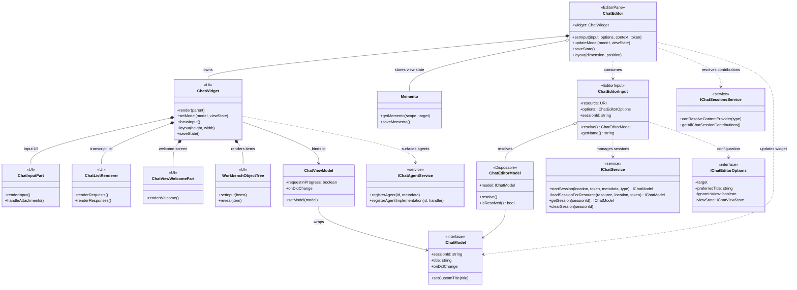

# Chat Editor UML Overview

```mermaid
classDiagram
    direction TB

    class ChatEditor {
        <<EditorPane>>
        +widget: ChatWidget
        +setInput(input, options, context, token)
        +updateModel(model, viewState)
        +saveState()
        +layout(dimension, position)
    }

    class ChatEditorInput {
        <<EditorInput>>
        +resource: URI
        +options: IChatEditorOptions
        +sessionId: string
        +resolve() ChatEditorModel
        +getName() string
    }

    class ChatEditorModel {
        <<Disposable>>
        +model: IChatModel
        +resolve()
        +isResolved() bool
    }

    class ChatWidget {
        <<UI>>
        +render(parent)
        +setModel(model, viewState)
        +focusInput()
        +layout(height, width)
        +saveState()
    }

    class ChatInputPart {
        <<UI>>
        +renderInput()
        +handleAttachments()
    }

    class ChatListRenderer {
        <<UI>>
        +renderRequests()
        +renderResponses()
    }

    class ChatViewWelcomePart {
        <<UI>>
        +renderWelcome()
    }

    class WorkbenchObjectTree {
        <<UI>>
        +setInput(items)
        +reveal(item)
    }

    class ChatViewModel {
        +requestInProgress: boolean
        +onDidChange
        +setModel(model)
    }

    class IChatModel {
        <<interface>>
        +sessionId: string
        +title: string
        +onDidChange
        +setCustomTitle(title)
    }

    class IChatService {
        <<service>>
        +startSession(location, token, metadata, type) IChatModel
        +loadSessionForResource(resource, location, token) IChatModel
        +getSession(sessionId) IChatModel
        +clearSession(sessionId)
    }

    class IChatSessionsService {
        <<service>>
        +canResolveContentProvider(type)
        +getAllChatSessionContributions()
    }

    class IChatAgentService {
        <<service>>
        +registerAgent(id, metadata)
        +registerAgentImplementation(id, handler)
    }

    class IChatEditorOptions {
        <<interface>>
        +target
        +preferredTitle: string
        +ignoreInView: boolean
        +viewState: IChatViewState
    }

    class Memento {
        +getMemento(scope, target)
        +saveMemento()
    }

    ChatEditor *-- ChatWidget : owns
    ChatEditor o-- Memento : stores view state
    ChatEditor ..> ChatEditorInput : consumes
    ChatEditor ..> IChatSessionsService : resolves contributions
    ChatEditor ..> IChatModel : updates widget

    ChatEditorInput o-- ChatEditorModel : resolves
    ChatEditorInput ..> IChatService : manages sessions
    ChatEditorInput ..> IChatEditorOptions : configuration

    ChatEditorModel --> IChatModel

    ChatWidget *-- ChatInputPart : input UI
    ChatWidget *-- ChatListRenderer : transcript list
    ChatWidget *-- ChatViewWelcomePart : welcome screen
    ChatWidget *-- WorkbenchObjectTree : renders items
    ChatWidget --> ChatViewModel : binds to
    ChatViewModel --> IChatModel : wraps
    ChatWidget ..> IChatAgentService : surfaces agents
```
